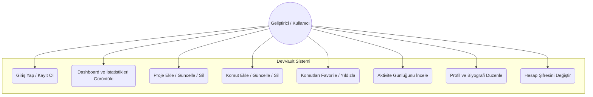
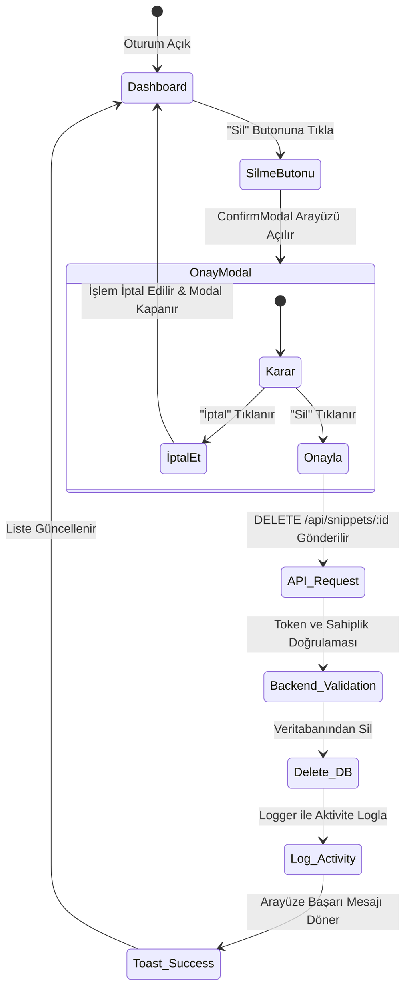
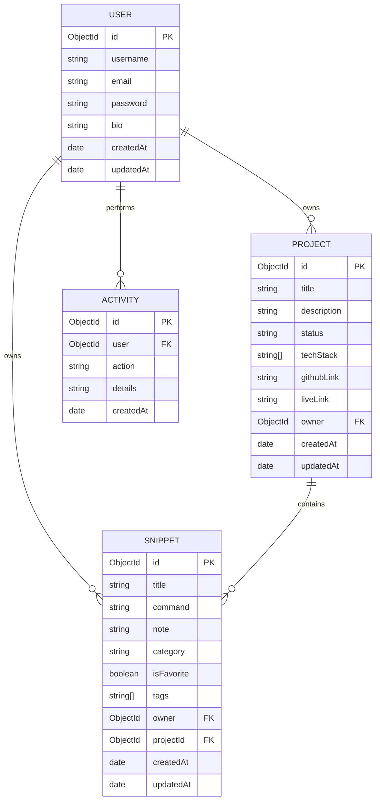
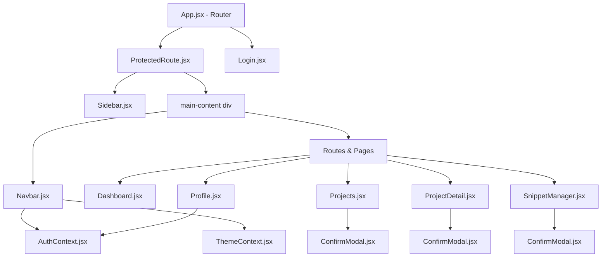

# DevVault - UML ve Tasarım Dokümantasyonu

Bu doküman, projenin UML diyagramlarını, veritabanı ilişkilerini (ERD) ve React bileşen mimarisini içermektedir. Diyagramlar, GitHub ve Markdown okuyucular tarafından otomatik olarak görselleştirilebilen **Mermaid** sözdizimi ile hazırlanmıştır.

---

## 1. Use-Case Diagram (Kullanım Senaryoları Diyagramı)

Sistemdeki geliştirici (kullanıcı) rolünün gerçekleştirebileceği temel işlevleri ve sistem sınırlarını gösterir.

---

## 2. Activity Diagram (Aktivite Akış Diyagramı)

Sistemde en sık yapılan işlemlerden biri olan **"Komut Silme ve Onay/İptal Akışı"** aktivitesinin akış diyagramıdır.

---

## 3. ER Diagram (Veritabanı Varlık-İlişki Diyagramı)

Mongoose üzerinde modellenen koleksiyonlar (`users`, `projects`, `snippets`, `activities`) ve aralarındaki `ObjectId` referans ilişkilerini gösterir.

---

## 4. Component Relation Diagram (React Bileşen İlişkileri Diyagramı)

Ön yüzde kullanılan React Router yapısını, korumalı rotaları (Protected Routes), context'leri ve modalların bileşen hiyerarşisindeki yerleşimini gösterir.

